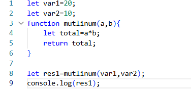
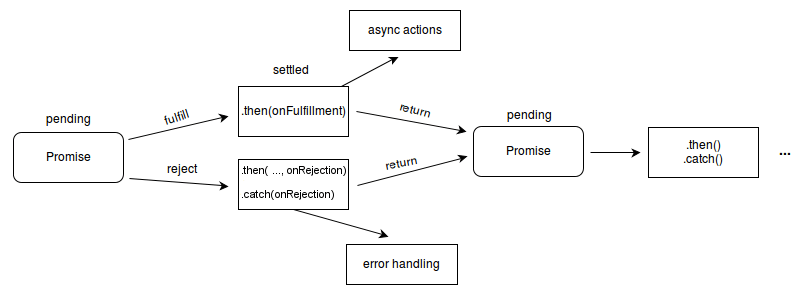

# JavaScript String Functions

**String functions used**

toUpperCase(), toUpperCase()
length,replace('character','with character') and similarly replaceAll()
```bash
let str=new Number(45);
console.log(str);  will create object of the number  output->[Number: 45]
```

toLocaleString() will provide commas according to indian standard and english standard eg., 
```bash
let str=4500000000000;
console.log(str.toLocaleString('en-IN'));
output-> 45,00,00,00,00,000
```
```bash
let str=4500000000000;
console.log(str.toLocaleString('en-US'));
output->4,500,000,000,000
```


***Math Libray***

Math lib yha smany inbuit functions like pow,abs,round,ceil,floor
examples-
```bash
console.log(Math)
console.log(Math.abs(-899));
console.log(Math.ceil(4.1));
console.log(Math.floor(4.9));
console.log(Math.round(4.5));
console.log(Math.max(1,4,5,6,7,8,9,0,-90));
console.log(Math.min(1,4,5,6,7,8,9,0,-90));
console.log(Math.random());//gives random number between 0 and 1
console.log(Math.random()*100);
console.log(Math.round(Math.random()*100));

Solutions->
Object [Math] {}
899
5
4
5
9
-90
0.8020392785511281
18.05107973718274
47
```
<hr>

***LOOPS***-*for,while,do while*

**for loop**
```bash
syntax: for(initialization;condition;after through){
    statements;
}

example-> for(let i=1;i<=5;i++){
    console.log("Manas);
}
```

**while loop**
```bash
let i=0;
while(condition){
    console.log();
    i++;
}
```

**do-while**
```bash
let i=0;
do{
    console.log();
    i++;
}while(condition);
```

**for of loop**

*for...of works only on iterable objects like:
Arrays
Strings
Maps
Sets

it will give out all the character or number of an array in form of individual char or no. example->
gives out values as result in key value pair
```bash
let str=345;
str=String(str);
for(let i of str){
    console.log(i);
}
Output->
3
4
5
```

**for in loop**
```bash
Object created of str-

let str={
    name: "Manas",
    age: 20,
    city: "Delhi"
}
for(let i in str){
    console.log(i);
}
gives out the key ot index as result output->
name
age
city
```

to print all data-
```bash
let student={
    name: "Manas",
    age: 20,
    city: "Delhi"
}
for(let iterator in student){
    console.log(iterator,student[iterator]);
}

output-> name Manas
age 20
city Delhi
```

**ARRAYS-**

collection of items or grp of similar items used in [].
values ko store karne ka linear tarika.
```bash
syntax:
let arrayNmae=['AJAY','Manas','kunal'];
here similar type ka data hi store kr sakte hai
```

* array are mutable

# JavaScript Array Functions

## Add / Remove Elements

- **`push()`** – add element at end
```js
arr.push(10);
```

- **`pop()`** – remove element from end
```js
arr.pop();
```

- **`unshift()`** – add element at start
```js
arr.unshift(5);
```

- **`shift()`** – remove element from start
```js
arr.shift();
```

## Traversing Arrays

- **`forEach()`** – iterate through array
```js
arr.forEach(item => console.log(item));
```

- **`map()`** – create new transformed array
```js
const doubled = arr.map(x => x * 2);
```

- **`filter()`** – filter elements
```js
const even = arr.filter(x => x % 2 === 0);
```

- **`reduce()`** – reduce to single value
```js
const sum = arr.reduce((a, b) => a + b, 0);
let arr2=[5,4,90,2,1];
arr2.sort((a, b) => b - a);
console.log(arr2);

let result = arr2.reduceRight((acc, curr) => acc + curr, 0);
console.log(result);

Output->
[ 1, 2, 4, 5, 9 ]
[ 90, 5, 4, 2, 1 ]
102
```
Here acc means accumulator and curr means current where the procedure starts from end and value is added here like `acc+curr` and 0 at end is initial vaule of accumulator.


## Searching Elements

- **`includes()`** – check if element exists
```js
arr.includes(3);
```

- **`indexOf()`** – find index of element
```js
arr.indexOf(3);
```

- **`find()`** – find first matching element
```js
arr.find(x => x > 10);
```

- **`findIndex()`** – find index of matching element
```js
arr.findIndex(x => x > 10);
```

## Modify Arrays

- **`splice()`** – add / remove elements
```js
arr.splice(1, 2);
```

- **`slice()`** – copy portion of array
```js
arr.slice(1, 4);
```

- **`concat()`** – merge arrays
```js
arr1.concat(arr2);
```

## Sorting & Reversing

- **`sort()`** – sort array
+ sort lexicograhically
```js
arr.sort((a, b) => a - b);
example-
let arr1=[1,2,9,4,5];
arr1.sort((a, b) => a - b);
console.log(arr1);

let arr2=[5,4,90,2,1];
arr2.sort((a, b) => b - a);
console.log(arr2);\

`output`-
[ 1, 2, 4, 5, 9 ]
[ 90, 5, 4, 2, 1 ]

```

- **`reverse()`** – reverse array
```js
arr.reverse();
```

## Convert Array

- **`join()`** – convert to string
```js
arr.join(", ");
```

- **`toString()`** – convert to string
```js
arr.toString();
```

## Condition Checking

- **`some()`** – at least one element matches
```js
arr.some(x => x > 5);
```

- **`every()`** – all elements match
```js
arr.every(x => x > 0);
```

## Notes

- `map`, `filter`, `reduce` → do not modify original array
- `splice`, `sort`, `reverse` → modify original array
- `slice` → returns a new array


## Object in JS
an object is a collection of ket-value pairs-
for example
```bash
let person={
name: "Manas",
age:20,
city: "Delhi"
};
Here name,city,age-> keys(properties)
"Manas",20,"Delhi"-> vaules
```

+ ## Ways to Create Objects in JavaScript
 **1. Object Literal (MOST COMMON)**
 ```bash
 const user = {
  username: "manas123",
  email: "manas@gmail.com",
  isLoggedIn: true
};

✔ Easy to read
✔ Most used in real projects
✔ Does NOT create a singleton by default
✔ Keys to be in string only
```
Access values:
```bash
console.log(user.username);   // manas123
console.log(user["email"]);  // manas@gmail.com
```
**2. Using new Object() (Singleton Object)**
```bash
const user = new Object();

user.name = "Manas";
user.age = 20;

A singleton means:
Only ONE instance of an object exists

In JS:
new Object() → Singleton
Object literal {} → Not singleton
```
Another method in through constructor that we will see after wards.

## Symbol in JavaScript
symbol is primitive data type like no,string
eg-> 
```bash
const sym=Symbol("id");
```
+ every symbol is unique

**Why do we need them?**

Symbols are mainly used to:
+ Create unique object keys
+ Avoid name collision
+ Hide internal/private properties

**Using symbol as an object key**

wrong way of using it->
```bash

const mySym = Symbol("key");

const obj = {
  mySym: "value"
};

console.log(obj.mySym); // "value"

// Here if you are using the symbol you dont havw to wrte it like just like guven above instead square braces will get used there->

## Correct way->

const mySym = Symbol("key");

const obj = {
  [mySym]: "value"
};

console.log(obj[mySym]); // "value"

📌 Square brackets [] are mandatory for Symbol keys.
```

+ Singleton obejct is->
```bash
const user=new Object();
```
+ Non singleton object->
```bash
cosnt user={
//key-value
};
```
+ we can do nesting in objects creation
```bash
const user = {
  name: "Manas",
  age: 20,
  address: {
    city: "Delhi",
    pincode: 110001
  }
};

to access it->
console.log(user.address.city); //"Delhi"

```
## To merge two objects->
+ Using spread operator
```bash

const obj1 = { a: 1, b: 2 };
const obj2 = { c: 3, d: 4 };

const merged = { ...obj1, ...obj2 };

console.log(merged);
// { a: 1, b: 2, c: 3, d: 4 }

```
+ Using **Object.assign()**->
```bash
const obj1 = { x: 1 };
const obj2 = { y: 2 };

const merged = Object.assign({}, obj1, obj2);

if yopu do this Object.assign(obj1, obj2); obj1 gets modified

```
## Object De-structuring
Object destructuring means:

Extracting values from an object and storing them in variables in one line
```bash
Instead of doing this->

const user = {
  name: "Manas",
  age: 20,
  city: "Delhi"
};

const name = user.name;
const age = user.age;

We do this:

const { name, age } = user;

yeh kya karga jaise humare pass keys ke name kaafi bade length ke ho sakte hia toh unko baar baar use krne me problem hota hai toh i=unko woh ek alag name se re defibed kardega yha toh unn keys ko hum ek alag name de denge aur fir unko use krenge

jaise issi example me-
const user = {
  name: "Manas",
  age: 20,
  city: "Delhi"
};

const{name: n,age: a}=user
console.log(user);

```
## Function in JS
A function is a block of reusable code that performs a task.

👉 Instead of writing the same code again and again, we call a function.
```bash
1. Function declaration->

function greet() {
  console.log("Hello Manas");
}

calling the dunction->
greet();

2. Function with parametrs->
function greet(name) {
  console.log("Hello " + name);
}

greet("Manas");
greet("Rahul");

3. Function with Return Value
function add(a, b) {
  return a + b;
}
const sum = add(5, 3);
console.log(sum); // 8


4. Function Expression
const multiply = function (a, b) {
  return a * b;
};

console.log(multiply(4, 5)); // 20

5. Arrow Function (MODERN JS 🔥)
const subtract = (a, b) => {
  return a - b;
};

short form->
const subtract = (a, b) => a - b;

6. Function with Object
function printUser(user) {
  console.log(user.name, user.age);
}

printUser({ name: "Manas", age: 20 });


7. Function with Destructuring
function printUser({ name, age }) {
  console.log(name, age);
}

printUser({ name: "Manas", age: 20 });
📌 Very common in APIs & React props

8. Callback Function
function process(callback) {
  callback();
}

process(() => {
  console.log("Callback executed");
});
📌 Used in:
setTimeout
map, filter
API calls

9. Anonymous Function
setTimeout(function () {
  console.log("Hello after 2 sec");
}, 2000);

```

## This keyword
- 👉 this refers to the object that is currently calling the function.
- ⚠️ this is not fixed — its value changes based on how a function is called, not where it is written.

+ In global space the role this keyword is based on that environment it is running on...as js mainly runs on run time time if we run this 
```bash
console.log(this);

this will give empty braces{} in vs code editor terminal but when run on browser through inpect mode it will give output as Window object
```
- when used inside a function like-
```bash
function ABC(){
    console.log(this);
}
ABC();
agar hum non strict mode use karte hai toh joi bhi function ki value hogi usse global space me convert krdega aur agar "use strict"; use karte ho toh function ki value nikle gi woji output hoga
```
- so depned karta hai strict mode and non-strict mode
- this keyword can also be called inside the object's method
```bash
const dsa={
a: 10,
b: function(){ 
//agar object ke andar ek function bnadete hai toh woh method kha jayega
    console.log(this);
    }
}
dsa(b);
```
## this in arrow function-
- Arrow function apna khud ka this nahi banate.
- Ye lexical this use karte hain, matlab apne surrounding (parent) scope ka this lete hain.
- Normal function me this caller object par depend karta hai
- Arrow function callback me bahut useful hai
```bash
const person = {
  name: "Manas",
  greetNormal: function() {
    console.log("Normal:", this.name);
  },
  greetArrow: () => {
    console.log("Arrow:", this.name);
  }
};

person.greetNormal(); // Normal: Manas
person.greetArrow();  // Arrow: undefined

Explanation->

arrowGreet → Arrow function
Arrow function ka apna this nahi hota
Ye lexical this use karta hai → matlab jahan se function define hua waha ka this
Yaha arrow function global scope me define hua → this.name undefined
Output: undefined ❌

```

## Execution in js
code are execute din two phases-

**in short** -> 
phele memory creation phase hota hai jo ki variable ko declare karta hai...yha fir keh sakte hai jagah allocate karte hai and dusra jo ki execution phase woh jo chiz hum bhar rhe hai usko execute krta hai


1️⃣ **Memory Creation Phase (Creation / Hoisting Phase)**

What happens:
- JavaScript scans the code
- Memory is allocated for:
  - Variables
  - Functions
Rules:
- var → initialized with undefined
- let / const → allocated but not initialized (Temporal Dead Zone)
- function → fully stored in memory

⚠️ No code is executed in this phase.

2️⃣ **Execution Phase (Code Execution Phase)**

What happens:
- Code is executed line by line
- Variables get actual values
- Functions are called (new execution contexts are created)


**let see in given example**



here in the code lines are also there for the code so in the exectuion follows as-
- step1: *Global Environment*

      in this **this()** is aloocated.
- step2: *Memory creation phase*

      as see in code that var1 is written first so memoty will get allocated for var1 at starting it will be undefined and similary line no 2 for var2 the there in line 3 there is function defined so mutliNum -> defination and the in line no. 8 result is there so memory will get allocate for it and will set to undefined initially.

- step3: *Exceution phase*

      so here values will get assign and accordingly will get executed and in the function multiNum will get hold for some time and then resulut where function is getting called so a new varialbe environment will get created for it and for every call there will be new phase created accordingly.


**What is Call Stack?**

👉 Call Stack is a data structure that keeps track of which function is currently being executed in JavaScript.

Call Stack = execution order manager for functions

How Call Stack Works
- JavaScript uses a stack (LIFO) structure
- When a function is called → it is pushed onto the stack
- When a function finishes → it is popped from the stack
```bash
function a() {
  b();
}

function b() {
  console.log("Hello");
}

a();

Call Stack Flow

1️⃣ Global Execution Context added
2️⃣ a() pushed
3️⃣ b() pushed
4️⃣ b() finishes → popped
5️⃣ a() finishes → popped


Call Stack
---------
b()
a()
Global()

```
**Why Call Stack is Important?**
- Ensures correct execution order

- Handles nested function calls

- Helps detect stack overflow errors

- Works with execution contexts

**Which pattern is followed in the JavaScript Call Stack?**

👉 JavaScript Call Stack follows the LIFO pattern

🧱 LIFO = Last In, First Out

So basically Call Stack is a data structure that JavaScript uses to keep track of function execution.
Whenever a function is called, its execution context is pushed onto the stack, and when the function finishes, it is popped out.
It follows the LIFO (Last In, First Out) principle.


**What is Execution Context?**

🔹 What is Execution Context in JavaScript?

👉 Execution Context is an environment where JavaScript code is evaluated and executed.

In simple words:

*Execution Context* = where JS code runs + where variables, functions, and this are decided

🔹 Types of Execution Context

1️⃣ **Global Execution Context (GEC)**
- Created when JS file starts
- Only one GEC exists
- In browser:
  - this → window
- In Node.js:
  - this → {}
```bash
var a = 10;
console.log(a);
```
2️⃣ **Function Execution Context (FEC)**
- Created every time a function is called
- Each function call → new execution context
```bash
function add(x, y) {
  return x + y;
}

add(2, 3);
add(5, 6);

Two separate execution contexts created
```

<hr>

# DOM (Document Object Model)

## What is DOM?
The **DOM (Document Object Model)** is a **programming interface** for HTML and XML documents.  
It represents the web page as a **tree-like structure**, where each element is an **object** that JavaScript can access and manipulate.

In simple words:
> **DOM = structured representation of a web page that JavaScript can control**

---

## Why do we need DOM?
The DOM allows JavaScript to:
- Access HTML elements
- Change content and styles
- Add or remove elements
- Handle user interactions (clicks, input, etc.)

Without DOM, JavaScript could not interact with web pages.

---

## DOM Structure (Tree Representation)

```html
<html>
  <body>
    <h1>Hello</h1>
    <p>Welcome</p>
  </body>
</html>

Accessing DOM Elements

document.getElementById("title");
document.getElementsByClassName("box");
document.getElementsByTagName("p");
document.querySelector(".container");
document.querySelectorAll("li");
```

# DOM Manipulation

## What is DOM Manipulation?
DOM Manipulation is the process of **accessing, modifying, creating, and removing** HTML elements dynamically using JavaScript.  
It allows web pages to update content, structure, and style **without reloading**.

---

## Accessing DOM Elements

```js
document.getElementById("title");
document.getElementsByClassName("box");
document.getElementsByTagName("p");
document.querySelector(".container");
document.querySelectorAll("li");
```
# setAttribute() - Complete Guide

## 1️⃣ What is setAttribute()?

```javascript
element.setAttribute(attributeName, value);
```

### Parameters
- **attributeName** → Name of the attribute (string)
- **value** → Value to assign (string)

### Return value
- Nothing (`undefined`)

---

## 2️⃣ How it works internally (simple idea)

When you call `setAttribute()`:

1. Browser locates the element in the DOM
2. Checks:
   - If attribute exists → updates its value
   - If attribute does not exist → creates it
3. DOM is updated
4. Browser re-renders if needed

---

## 3️⃣ Basic Example

**HTML**
```html
<button id="btn">Click me</button>
```

**JavaScript**
```javascript
let btn = document.getElementById("btn");
btn.setAttribute("class", "primary-btn");
```

**Resulting HTML**
```html
<button id="btn" class="primary-btn">Click me</button>
```

---

## 4️⃣ Updating an Existing Attribute

```javascript
btn.setAttribute("class", "danger-btn");
```

✔ Old class is replaced, not merged.

---

## 5️⃣ Adding New Attributes

```javascript
btn.setAttribute("title", "Click this button");
btn.setAttribute("disabled", "true");
```

**Output**
```html
<button disabled="true" title="Click this button">Click me</button>
```

⚠️ For boolean attributes (`disabled`, `checked`), presence matters, value doesn't.

---

## 6️⃣ Reading Attributes

```javascript
btn.getAttribute("class");  // "danger-btn"
```

---

## 7️⃣ Removing Attributes

```javascript
btn.removeAttribute("disabled");
```

---

## 8️⃣ setAttribute() vs Properties (IMPORTANT for interviews)

### ❌ Using setAttribute
```javascript
input.setAttribute("value", "Manas");
```

### ✅ Using property (preferred)
```javascript
input.value = "Manas";
```

### Difference

| Attribute | Property |
|-----------|----------|
| HTML level | DOM object level |
| String only | Can be any type |
| Static | Dynamic |

**👉 Interview line:**
> `setAttribute()` changes the HTML attribute, while properties reflect the current state of the DOM object.

---

## 9️⃣ Common Mistakes

### ❌ Overwriting classes
```javascript
el.setAttribute("class", "box");
```

### ✅ Correct way
```javascript
el.classList.add("box");
```

---

## 🔟 When should you use setAttribute()?

### ✔ For:
- Custom attributes
- `data-*` attributes
- SEO/meta attributes

**Example:**
```javascript
div.setAttribute("data-id", "123");
```

## EVENTS

An event is an action or occurrence that happens in the browser, which the JavaScript can detect and respond to. Examples include:

- Clicking a button (click)
- Hovering over an element (mouseover)
- Pressing a key (keydown, keyup)
- Loading a page (load)
- Submitting a form (submit)

In short: anything a user does or the browser does that can be detected.

**Event handling** is the process of writing code to respond to events. The code that responds to an event is called an event handler.

There are two type sof event handling -

1. **Inline Event Handling (HTML Attribute Method)**

You can directly attach a function to an HTML element using an attribute like onclick, onmouseover, etc.
```html
<button onclick="sayHello()">Click Me</button>

<script>
function sayHello() {
  alert("Hello, World!");
}
</script>
```
✅ Pros: Simple and easy for beginners.

❌ Cons: Mixes HTML and JavaScript; not recommended for large projects.

As html code gets bulky here in inline event handling

2. **Using JavaScript (Recommended)**
  - Using DOM Property

    You can assign a function to an element’s event property in JavaScript.
    ```html
    <button id="btn">Click Me</button>
    <script>
    let button = document.getElementById("btn");
    button.onclick = function() {
      alert("Hello!");
    };
    </script>
    ```
  -  **Using addEventListener (Best Practice)**
  addEventListener allows multiple handlers on the same element and is more flexible.

      ```js
      Syntax
      element.addEventListener(event, handler, options);
      ```

      here ->
      1. event (string) – The type of event you want to listen for, e.g., "click", "mouseover", "keydown", etc.

      2. handler (function) – The function that will run when the event occurs. It can be a named function or an anonymous function.

      3. options (optional) – An object or boolean that specifies characteristics of the event listener:

          - capture: true → Use capturing phase instead of bubbling.

          - once: true → Listener will execute only once and then remove itself.

          - passive: true → Listener will never call preventDefault() (improves performance for scroll events).
      ```js
      Example 1: Simple Click Event
      let button = document.getElementById("btn");
      button.addEventListener("click", function() {
        alert("Button clicked!");
      });


      Example 2: Using a Named Function
      function sayHello() {
        console.log("Hello!");
      }
      button.addEventListener("click", sayHello);


      Example 3: Using Options
      button.addEventListener(
        "click",
        () => console.log("Clicked once!"),
        { once: true } // This will run only one time
      );
      ```
      
      ```html
        <button id="btn">Click Me</button>
        <script>
          let button = document.getElementById("btn");
          button.addEventListener("click", function() {
            alert("Hello from addEventListener!");
          });
          // Another handler
          button.addEventListener("click", function() {
            console.log("Button clicked!");
          });
          </script>
      ```
  - **Event Object**
    When an event occurs, an event object is automatically passed to the handler function. It contains details about the event, like:

      - event.type → Type of event (click, keydown, etc.)
      - event.target → Element that triggered the event
      - event.preventDefault() → Stops default browser behavior
      - event.key → Key pressed (for keyboard events)
      - event.clientX / event.clientY → Mouse coordinates
      ```js
      document.getElementById("btn").addEventListener("click", function(event) {
      console.log("Event Type: " + event.type);
      console.log("Clicked Element: ", event.target);
    });
    ```

# JavaScript: Synchronous vs Asynchronous Guide

## 1️⃣ Synchronous (Sync)

### 📌 Meaning

- Synchronous code runs line by line.
- Each task waits for the previous one to finish.

### 🧠 Rule

"One thing at a time."

### ✅ Example
```javascript
console.log("A");
console.log("B");
console.log("C");
```

### 🟢 Output
```
A
B
C
```

⏳ **If B takes time → C must wait.**

---

## 2️⃣ Asynchronous (Async)

### 📌 Meaning

- Asynchronous code does NOT block execution.
- Time-taking tasks run in background and finish later.

### 🧠 Rule

"Start now, finish later."

### ✅ Example
```javascript
console.log("A");

setTimeout(() => {
  console.log("B");
}, 1000);

console.log("C");
```

### 🟢 Output
```
A
C
B
```

➡️ **setTimeout is async, so JS continues.**

---

## 3️⃣ Main Stack (Call Stack)

### 📌 What is it?

The Call Stack is where JavaScript executes functions.

### 🧠 How it works

- Uses LIFO (Last In, First Out)
- Every function call is pushed
- After execution, it is popped

### ✅ Example
```javascript
function one() {
  two();
}
function two() {
  console.log("Hello");
}
one();
```

### 📦 Stack Flow
```
one()
  two()
    console.log()
```

---

## 4️⃣ Side Stack (Web APIs / Task Queue)

### 📌 What is Side Stack?

JavaScript sends async operations to:

- Browser Web APIs
- Timer APIs
- Fetch APIs

### 📌 Examples

- setTimeout
- setInterval
- fetch
- DOM events

```javascript
setTimeout(() => {
  console.log("Async");
}, 1000);
```

➡️ **Timer runs in Side Stack, NOT main stack.**

---

## 5️⃣ Event Loop (The Boss 🧠)

### 📌 What is Event Loop?

The Event Loop checks:

- Is the Call Stack empty?
- If yes → move callback from Queue to Call Stack

### 🧠 Its job

"Push async tasks back into main stack when it's free."

---

## 🔁 Complete Flow (Very Important)

```javascript
console.log("Start");

setTimeout(() => {
  console.log("Timeout");
}, 0);

console.log("End");
```

### 🔍 Execution Steps

1. "Start" → Call Stack
2. setTimeout → Side Stack (Web API)
3. "End" → Call Stack
4. Call Stack empty
5. Event Loop moves Timeout callback to Call Stack

### 🟢 Output
```
Start
End
Timeout
```

---

## 🧠 Diagram in Words

```
Main Stack        Side Stack        Queue
-----------      -----------       -----
console.log      setTimeout        callback
```

**Event Loop keeps checking 👀**

---

## 🎯 Interview Ready Summary (Say This)

1. **Synchronous code** executes line by line and blocks execution.
2. **Asynchronous code** runs in the background and does not block the main thread.
3. The **Call Stack** executes functions using LIFO.
4. **Async operations** go to Web APIs (side stack).
5. The **Event Loop** moves completed async callbacks back to the call stack when it is empty.

---

## ⭐ One-Line Memory Trick

- **Sync** → wait
- **Async** → later
- **Stack** → LIFO
- **Event Loop** → manager

## API Learning

what is XMLHttpRequest (XHR) in JavaScript?

XMLHttpRequest (XHR) is an old JavaScript object used to send HTTP requests to a server and receive responses without reloading the page.

👉 It was the first way to call APIs from JavaScript.

🔗 How XMLHttpRequest is related to API

An API is just a URL that accepts requests and returns data.

XMLHttpRequest is a tool that:

- sends requests to an API

- receives API responses (JSON / XML / text)

So:

API = destination
XMLHttpRequest = vehicle that talks to the API

# 🌍 The Whole Story of API in JavaScript

## 1️⃣ Before APIs (Old Web Days)

- Web pages were **static**
- Every request caused a **full page reload**
- No dynamic data
- ❌ Bad user experience

---

## 2️⃣ Birth of APIs + AJAX 🚀

To make web pages dynamic, browsers introduced:

### 🔹 API (Application Programming Interface)

An API is:
> A contract (URL + rules) that allows data exchange between client and server

### 🔹 AJAX (Asynchronous JavaScript and XML)

AJAX is a **technique**, not a language.

👉 It allowed:
- Background data loading
- No page reload

---

## 3️⃣ First API Tool: XMLHttpRequest (XHR)

### 🔹 What is XMLHttpRequest?

- A JavaScript object
- Used to call APIs
- Enabled AJAX

### 🔹 Why "XML" in the name?

- Earlier, responses were in **XML**
- Today mostly **JSON**

### 🔹 Example

```javascript
const xhr = new XMLHttpRequest();
xhr.open("GET", "/users");
xhr.send();
```

### ❌ Problems with XHR

- Complex syntax
- Callback-based
- Hard error handling

---

## 4️⃣ Browser Web APIs Enter the Scene 🌐

Browsers added **Web APIs** to support async tasks:

**Examples:**
- `XMLHttpRequest`
- `setTimeout`
- `fetch`
- DOM APIs

⚠️ **These are not part of JavaScript language**  
They are provided by the **browser environment**

---

## 5️⃣ The JavaScript Engine (V8) 🧠

### 🔹 What is V8?

- JS engine by Google
- Executes JavaScript code

### 🔹 What V8 does NOT do

❌ It does NOT:
- Make HTTP calls
- Handle timers
- Access DOM

✔️ **It only runs JS**

---

## 6️⃣ Modern API Tool: fetch() ✅

### 🔹 Why fetch?

To replace XHR with:
- Cleaner syntax
- Promises
- Better readability

### 🔹 Example

```javascript
fetch("/users")
  .then(res => res.json())
  .then(data => console.log(data));
```

✔️ Still uses browser Web APIs internally

---

## 7️⃣ Even Better: Axios (Library)

### 🔹 What is Axios?

- External JS library
- Built on top of fetch/XHR

### 🔹 Benefits:

- Auto JSON conversion
- Interceptors
- Better error handling

```javascript
axios.get("/users").then(res => console.log(res.data));
```

---

## 8️⃣ Types of APIs in JavaScript (Big Picture)

### 🔸 Based on usage

| Type | Example |
|------|---------|
| Web APIs | DOM, fetch |
| REST APIs | /users, /login |
| Third-party APIs | Google Maps, Stripe |

### 🔸 Based on tools

| Tool | Purpose |
|------|---------|
| XMLHttpRequest | Old API calls |
| fetch | Modern API calls |
| Axios | Simplified API calls |

---

## 9️⃣ Complete API Lifecycle (Frontend)

```
JS Code
 ↓
V8 Engine executes
 ↓
Browser Web API handles request
 ↓
Server API processes
 ↓
Response sent
 ↓
Event Queue
 ↓
Event Loop
 ↓
Call Stack
 ↓
V8 executes callback
```

---

## 🔟 Backend APIs (Node.js Side)

In Node.js:
- V8 executes JS
- Node APIs handle networking
- APIs are created, not just consumed

```javascript
app.get("/users", (req, res) => {
  res.json({ name: "Manas" });
});
```

---

## 🧠 One-liner Summary

> **APIs allow JavaScript to communicate with servers. XMLHttpRequest was the first tool, fetch replaced it, and axios simplified it. V8 executes JS while Web APIs handle async tasks.**

---

## 🎯 Interview Final Answer

> An API is a communication bridge between client and server. In JavaScript, APIs are accessed using tools like XMLHttpRequest, fetch, or axios. JavaScript runs on the V8 engine, while browsers provide Web APIs to handle asynchronous operations.


# 🔥 TYPES OF APIs (FULL PICTURE)

## 1️⃣ REST API (Most Common)

### 🔹 What is REST?

**REST** (Representational State Transfer) is an architecture style for APIs.

### 🔹 How it works

- Uses HTTP methods
- Each URL represents a resource

### 🔹 Example

```http
GET    /users        → get all users
POST   /users        → create user
GET    /users/1      → get user 1
PUT    /users/1      → update user
DELETE /users/1      → delete user
```

### 🔹 Data format

✔️ Mostly JSON

### 🔹 Used in

- Most frontend–backend apps
- Mobile apps
- Web apps

---

## 2️⃣ GraphQL API (Modern & Flexible)

### 🔹 What is GraphQL?

- A query language for APIs
- Client asks exact data needed

### 🔹 Example

```graphql
{
  user {
    name
    email
  }
}
```

### 🔹 Advantage

- ✔️ No over-fetching
- ✔️ Single endpoint

### 🔹 Used by

- Facebook
- GitHub

---

## 3️⃣ Web APIs (Browser APIs)

⚠️ **Web APIs are NOT server APIs**

They are features provided by the browser.

### Examples

- DOM API
- fetch API
- XMLHttpRequest
- setTimeout
- localStorage

👉 Used to interact with browser & system

---

## 4️⃣ Third-Party APIs

APIs provided by other companies.

### Examples

- Google Maps API
- Stripe API
- OpenWeather API

---

# 🔄 API CALL TOOLS (EVOLUTION)

## 1️⃣ XMLHttpRequest (Old)

```javascript
const xhr = new XMLHttpRequest();
xhr.open("GET", "/data");
xhr.send();
```

**Drawbacks:**
- ❌ Callback hell
- ❌ Hard to read

---

## 2️⃣ fetch() (Modern Standard)

```javascript
fetch("/data")
  .then(res => res.json())
  .then(data => console.log(data));
```

**Benefits:**
- ✔️ Promise-based
- ✔️ Cleaner syntax

---

## 3️⃣ axios (Most Developer-Friendly)

```javascript
axios.get("/data")
  .then(res => console.log(res.data));
```

**Benefits:**
- ✔️ Auto JSON
- ✔️ Better errors
- ✔️ Interceptors

---

# ⚔️ XHR vs fetch vs axios (INTERVIEW TABLE)

| Feature        | XHR      | fetch    | axios    |
|----------------|----------|----------|----------|
| Syntax         | Complex  | Simple   | Simplest |
| Promises       | ❌       | ✅       | ✅       |
| JSON parsing   | Manual   | Manual   | Auto     |
| Error handling | Hard     | Medium   | Best     |
| External lib   | ❌       | ❌       | ✅       |

---

# 🧠 API + EVENT LOOP (ONE-PAGE STORY)

```
JS Code runs
    ↓
V8 executes
    ↓
fetch() called
    ↓
Browser Web API handles HTTP
    ↓
Server API responds
    ↓
Callback → Queue
    ↓
Event Loop
    ↓
Call Stack
    ↓
V8 executes response handler
```

---

# 🎯 FINAL INTERVIEW ANSWER (PERFECT)

> **APIs allow communication between client and server. REST APIs are most common, GraphQL offers flexible queries, and Web APIs are browser-provided interfaces. In JavaScript, APIs are accessed using XMLHttpRequest, fetch, or axios. The V8 engine executes JavaScript while browsers handle API calls through Web APIs and the event loop.**

---

# 🧩 MEMORY HACK (1 LINE)

**API = communication, XHR = old, fetch = modern, axios = easiest, V8 = JS executor**

---

---
## Promises in Js
Promise(type of a object)  states

A Promise can be in one of these states:
- Pending – initial state (waiting)
- Fulfilled – operation completed successfully
- Rejected – operation failed

Once settled (fulfilled/rejected), the state cannot change.
```js
let promise = new Promise((resolve, reject) => {//Syntax
    let success = true;

    if (success) {
        resolve("Task completed");
    } else {
        reject("Task failed");
    }
});
resolve() → success

reject() → failure

promise
  .then((result) => {
      console.log(result); // Task completed
  })
  .catch((error) => {
      console.log(error); // Task failed
  })
  .finally(() => {
      console.log("Promise finished");
  });

Methods explained

.then() → runs on success

.catch() → runs on failure

.finally() → runs always

```
**Flow Diagram**




# JavaScript Promise Methods

| Method | Purpose |
|------|--------|
| `Promise.resolve()` | Returns a resolved promise |
| `Promise.reject()` | Returns a rejected promise |
| `Promise.all()` | Waits for all promises to fulfill (fails if any reject) |
| `Promise.race()` | Returns the first settled promise (fulfilled or rejected) |
| `Promise.any()` | Returns the first fulfilled promise (ignores rejections) |
| `Promise.allSettled()` | Returns results of all promises (fulfilled + rejected) |

## Notes
- `Promise.all()` → fails fast on rejection
- `Promise.any()` → fails only if all promises reject
- `Promise.allSettled()` → useful when you need every result
- The Promise constructor provides two parameters (resolve and reject), but using both is optional. When consuming a Promise, methods like then, catch, and finally do not require two arguments.

```js
Example-

console.log("Start");

const p = new Promise((resolve) => {
    console.log("Executor");
    resolve("Success");
});

p.then(result => {
    console.log(result);
});

console.log("End");
```
## Step-by-Step Execution Order of a Promise

| Step | What happens |
|------|--------------|
| 1 | `console.log("Start")` → pushed to Call Stack |
| 2 | Promise executor runs → logs `"Executor"` |
| 3 | `resolve()` settles the Promise |
| 4 | `.then()` callback is added to the **Microtask Queue** |
| 5 | `console.log("End")` → executed |
| 6 | Call Stack becomes empty |
| 7 | Event Loop checks and runs **Microtask Queue** |
| 8 | `.then()` callback executes |

---
```bash
Output:

Start
Executor
End
Success
```

**Promises with SetTimeOut**
```js

console.log("Start");

setTimeout(() => {
    console.log("Timeout");
}, 0);

Promise.resolve().then(() => {
    console.log("Promise");
});

console.log("End");


Execution Order:

Start
End
Promise
Timeout

```
